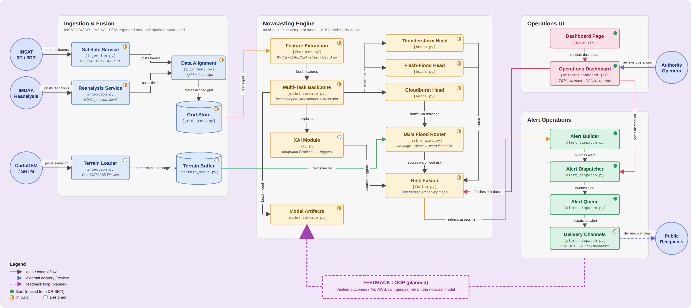
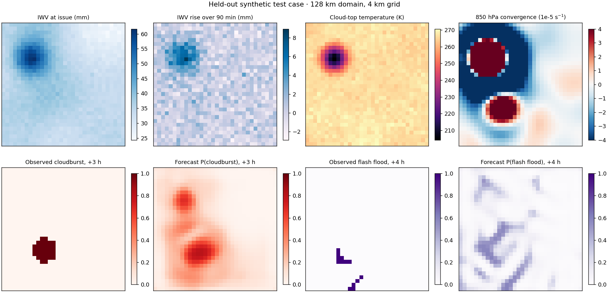
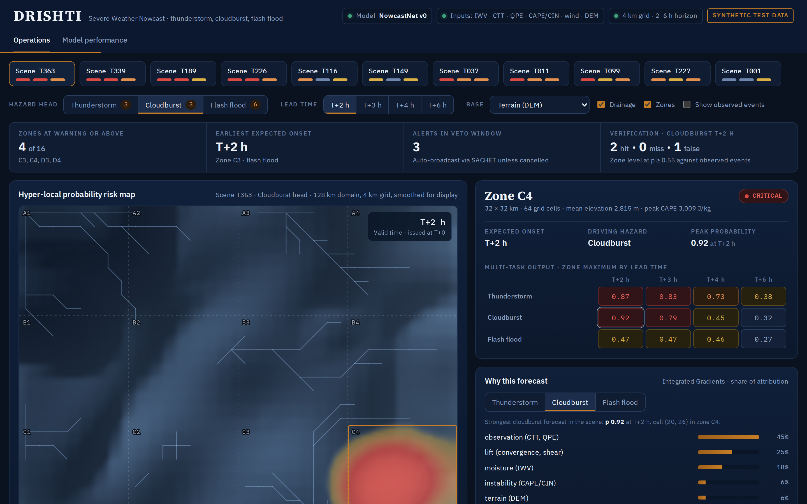

# DRISHTI Nowcast

**AI-driven hyper-local early warning system for severe weather nowcasting.**
A multi-task spatiotemporal deep learning model that predicts **severe thunderstorms, cloudbursts and flash floods 2 to 6 hours ahead** on a 4 km grid, from satellite (INSAT-3D/3DR), reanalysis (IMDAA) and terrain (DEM) inputs.

Team **ThunderBolts!** · Smart India Hackathon 2026 · Team ID 159702

> **Data notice.** This repository has no observational data yet. The model is trained and evaluated on **synthetic scenes** from [`synthetic.py`](drishti_nowcast/synthetic.py), which encode the physical precursors of convection (see below). The metrics show that the pipeline learns those precursors end to end. They are **not** estimates of skill on real Indian monsoon convection.



## Status

| | Component | Module | State |
|---|---|---|---|
| ● | Multi-task model, 3 hazard heads × 4 lead times | `model_service.py`, `heads.py` | Trained (v0, synthetic data) |
| ● | Feature extraction: IWV tendency, CTT drop rate, CAPE/CIN, 850 hPa convergence, bulk shear, terrain | `features.py` | Working |
| ● | DEM Flood Router (D8 drainage, runoff and probability routing) | `risk_engine.py` | Working |
| ● | Evaluation vs persistence and gradient-boosting baselines | `evaluate.py` | Working |
| ● | Explainable AI (Integrated Gradients, grouped by predictor family) | `xai.py` | Working |
| ● | Data alignment (regridding, time alignment, block averaging) | `alignment.py` | Working, tested |
| ◐ | INSAT-3D/3DR (MOSDAC) and IMDAA (NCMRWF) ingestion | `ingestion.py` | Interface defined, readers in build |
| ◐ | Spatiotemporal transformer encoder (v1, replaces ConvLSTM) | `model_service.py` | In build |
| ● | Operations dashboard: risk maps, zone outlook, XAI panel, tiered alerts, verification view | `frontend/` | Built (reads real model output) |
| ○ | Backend API and live SACHET / CAP dispatch | to be added from the DRISHTI platform | Designed |

● built · ◐ in build · ○ designed

## How it works

**Inputs** on a unified 4 km grid:

| Family | Source | Channels |
|---|---|---|
| Moisture (the fuel) | INSAT-3D/3DR water-vapour / TPW | Integrated water vapour (IWV) and its 90-min rise |
| Observation | INSAT-3D/3DR TIR 10.8 µm, satellite QPE | Cloud-top temperature (CTT), CTT drop rate, rain rate |
| Instability (the energy) | IMDAA reanalysis | CAPE, CIN |
| Lift (the trigger) | IMDAA reanalysis | 850 hPa convergence, 0–6 km bulk shear, steering wind |
| Terrain | CartoDEM / SRTM | Elevation, slope, log flow accumulation |

The model sees the last **3 hours of satellite frames at 30-minute steps** plus the environment at issue time.

**Model (v0, 272k parameters)**
1. **Temporal encoder:** a ConvLSTM reads the satellite frame sequence.
2. **Context encoder:** convolutions over the thermodynamic and terrain channels.
3. **Cross-attention fusion:** satellite-state tokens attend to the thermodynamic and terrain context.
4. **Shared backbone → multi-task heads:** separate heads output probability maps for thunderstorm, cloudburst and flash flood at **+2, +3, +4 and +6 h**.

Trained with **focal loss** (rare-event classification). The cloudburst and flash-flood heads are weighted above thunderstorm, and checkpoints are selected on validation PR-AUC (recall-oriented).

**Event definitions** (`config.py`):
- **Cloudburst:** rain rate ≥ 100 mm/h, the IMD criterion.
- **Thunderstorm:** convective rain under a cloud top ≤ 235 K.
- **Flash flood:** runoff from the previous 2 h, routed down the D8 drainage network, exceeding a depth threshold in a channel cell.

## Results (held-out synthetic test set, 400 scenes)

| Hazard @ lead | Base rate | Model PR-AUC | Gradient boosting PR-AUC | Model CSI | Model FSS (20 km) |
|---|---|---|---|---|---|
| Cloudburst +2 h | 0.25% | **0.54** | 0.15 | 0.33 | 0.67 |
| Cloudburst +3 h | 0.25% | **0.28** | 0.08 | 0.20 | 0.47 |
| Cloudburst +4 h | 0.24% | **0.14** | 0.03 | 0.12 | 0.37 |
| Cloudburst +6 h | 0.15% | 0.01 | 0.01 | 0.01 | 0.03 |
| Thunderstorm +2 h | 1.35% | **0.41** | 0.20 | 0.28 | 0.61 |
| Thunderstorm +3 h | 1.49% | **0.22** | 0.10 | 0.17 | 0.43 |
| Flash flood +2 h | 0.18% | 0.24 | **0.29** | 0.18 | 0.45 |
| Flash flood +4 h | 0.20% | **0.17** | 0.16 | 0.13 | 0.38 |

Full table with POD, FAR, persistence and every lead: [`results/metrics.md`](results/metrics.md).

What the numbers say:
- **Cloudburst and thunderstorm:** the multi-task model beats a per-pixel gradient-boosting model on the same features by 2–4× in PR-AUC at +2 to +4 h. Spatial and temporal context adds real skill over point features.
- **Skill decays with lead time**, and +6 h is near chance. On this data, most +6 h events have no visible precursor at issue time.
- **Flash flood:** roughly tied with gradient boosting, which gets flow accumulation as a direct per-pixel input. The next step is to feed the cloudburst head's output through the DEM Flood Router inside the network, not only as an input channel.



**Explainability.** For the example above (cloudburst at +3 h, p = 0.81), Integrated Gradients attributes the forecast to lift 56%, terrain 21%, observation (CTT, QPE) 10%, instability 8% and moisture 6%. See [`results/xai_example.json`](results/xai_example.json). The dashboard will show these shares per alert.

## Dashboard

`frontend/` is a Next.js operations dashboard. Every probability it shows is the trained model's output on held-out test scenes, exported by `scripts/export_frontend_data.py`.



- **Risk map:** probability map per hazard head and lead time over DEM relief, drainage and 32 km zones. The base layer can switch to IWV rise, cloud-top temperature or convergence.
- **Zone detail:** hazard × lead-time matrix, onset and driving hazard.
- **Why this forecast:** Integrated Gradients shares by predictor family.
- **Automated categorized alerts:** Tier 1 auto-broadcast, Tier 2 veto countdown, Tier 3 review, with CAP categories.
- **Show observed events:** overlays what actually happened. Each alert is marked verified or false alarm, and zone-level hits, misses and false alarms are counted.
- **Model performance tab:** test metrics against gradient-boosting and persistence baselines.

```bash
python scripts/export_frontend_data.py      # model -> frontend/public/data
cd frontend && npm install && npm run dev   # http://localhost:3000
npm run build                               # static site in frontend/out (Vercel / GitHub Pages)
```

## Run it

```bash
pip install -r requirements.txt
pytest -q                                   # 6 tests
bash scripts/run_all.sh                     # generate data, train, evaluate, explain, plot
```

Or step by step:
```bash
python -m drishti_nowcast.train --epochs 15          # ~17 min on 2 CPU cores
python -m drishti_nowcast.evaluate                   # writes results/metrics.{json,md}
python -m drishti_nowcast.xai --head cloudburst --lead 3
python scripts/make_figures.py
```

The trained checkpoint is included: `artifacts/nowcast_v0.pt`, with metadata in `artifacts/nowcast_v0.json`.

## Repository layout

```
drishti_nowcast/
  config.py          grid, history, lead times, event thresholds
  ingestion.py       MOSDAC / IMDAA / DEM readers (interfaces, in build)
  alignment.py       regrid, time-align, block-average onto the model grid
  grid_store.py      compressed storage of aligned grids + provenance
  synthetic.py       physically structured synthetic scenes (training data for now)
  features.py        IWV tendency, CTT drop rate, CAPE/CIN, convergence, shear, terrain
  model_service.py   NowcastNet: ConvLSTM + cross-attention fusion
  heads.py           thunderstorm / cloudburst / flash-flood heads
  risk_engine.py     DEM Flood Router (D8 flow, runoff and probability routing)
  train.py           focal-loss multi-task training
  evaluate.py        PR-AUC, Brier, POD, FAR, CSI, FSS vs baselines
  xai.py             Integrated Gradients by predictor family
frontend/            Next.js operations dashboard
artifacts/           trained checkpoint
results/             metrics, training history, figures, XAI example
docs/                architecture diagram
tests/               unit tests
```

## Roadmap

1. **Platform integration:** bring in the DRISHTI FastAPI backend (ward risk scoring, tiered alert dispatch). The dashboard switches from exported files to the API by setting `NEXT_PUBLIC_API_BASE`.
2. **Real data:** MOSDAC INSAT-3D/3DR frames and IMDAA pressure levels, labelled from IMD cloudburst and extreme-rain records.
3. **v1 model:** replace the ConvLSTM encoder with a spatiotemporal transformer, and couple the flash-flood head to the DEM Flood Router.
4. **Case replays:** Himachal Pradesh 2023, Wayanad 2024, Kishtwar 2025.

## References

- Shi et al. (2015). *Convolutional LSTM Network: A Machine Learning Approach for Precipitation Nowcasting.* NeurIPS.
- Gao et al. (2022). *Earthformer: Exploring Space-Time Transformers for Earth System Forecasting.* NeurIPS.
- Zhang et al. (2023). *Skilful nowcasting of extreme precipitation with NowcastNet.* Nature.
- Caruana (1997). *Multitask Learning.* Machine Learning.
- Lin et al. (2017). *Focal Loss for Dense Object Detection.* ICCV.
- Sundararajan et al. (2017). *Axiomatic Attribution for Deep Networks (Integrated Gradients).* ICML.
- Roberts & Lean (2008). *Scale-selective verification of rainfall accumulations (Fractions Skill Score).* Monthly Weather Review.
- Rani et al. (2021). *IMDAA: High-resolution satellite-era reanalysis for the Indian monsoon region.* Journal of Climate.
